# 喷漆效果 #

## 简介 ##
喷漆效果其实非常常见，比如人物脚底的选中圈，最著名就是CS里墙上的标语贴花、汽车上的喷漆等（见下图）。

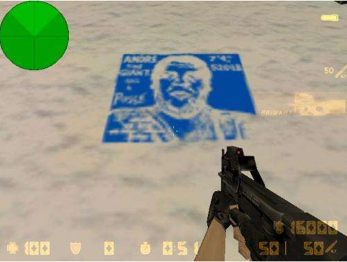

针对场景物品是静态还是动态，可使用投影器（Projector）、构造贴片网格或贴花实现。

## 投影器（Projector） ##
投影器（Projector）相当于对需要投影的对象重新渲染一遍。不过投影所使用的材质是特制的，根据投影器传入的Project矩阵进行uv计算，得到采样的uv值。

### 例子 ###
打开场景“ProjectorPaint”，玩家点击屏幕通过Physics.Raycast（射线检测）获取碰撞点，并将Projector(投影器）显示在场景，从而实现喷漆效果（见下图）。

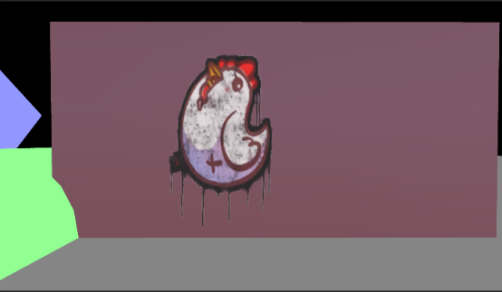

### 步骤 ###
1.添加包含Projector组件的预制体。
2.设置Projector的Material属性，最原始的主贴图（项目运行时可通过代码设置）。
3.运行项目通过Physics.Raycast获取碰撞点，并作为坐标将Projector对象显示在场景中。

### 存在问题 ###
1.Projector对象方向，选择**碰撞面的法线**或**发射射线的方向**。两者都存在显示问题。

**碰撞面的法线**
使相邻等于或大于90度的侧面无法显示（见下图）。

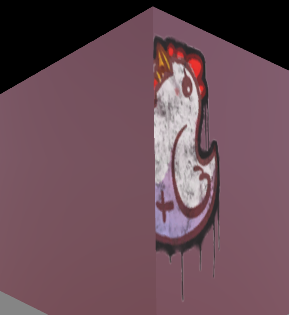

**发射射线的方向**
解决相邻侧面无法显示问题（见下图）。

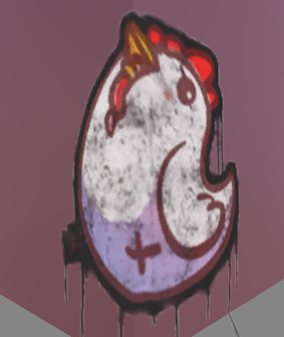

但随着射线方向与碰撞面的法线夹角越大，拉伸越大情况（见下图）。

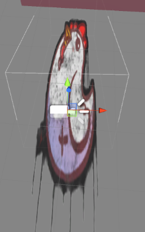

2.由于Projector(投影器）无法进行深度检测，会将图案投影到被遮挡的对象上（见下图）。

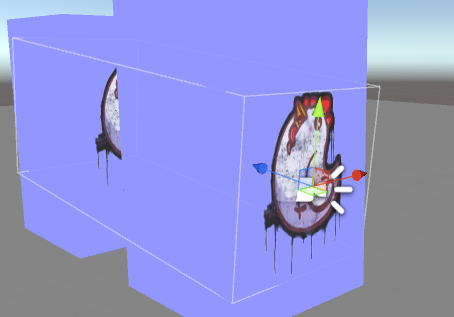

3.通过FrameDebug可以看到，Projector对需要投影的对象重新渲染，所以Projector也是由一定的性能代价的，如果一个Projector覆盖太多的物体可能会导致批次上升：

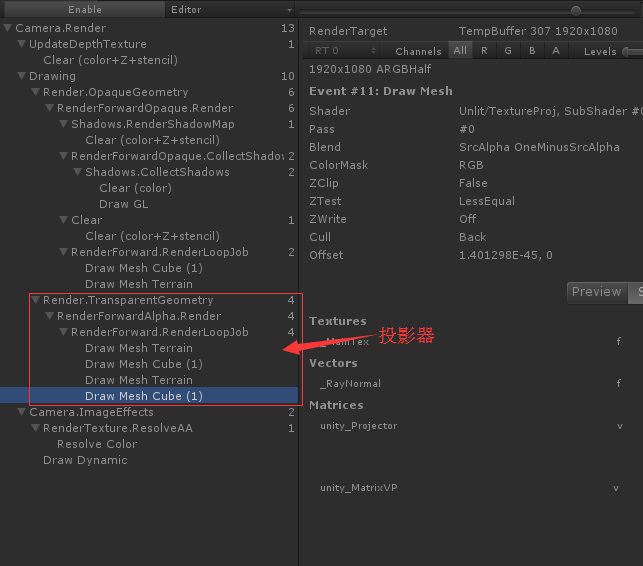

## 构造贴片网格 ##
简单来说，不是通过再渲染一遍物体实现，而是通过一个立方体进行碰撞检测。

### 步骤 ###
1.首先遍历所有MeshRenderer，然后获得与立方体相交的物体
2.遍历相交mesh所有的三角形，用立方体的六个面对每个三角形进行裁剪，获取新的顶点
3.经过立方体裁剪的网格数据生成mesh，并显示到场景

### 存在问题 ###
1、遍历所有MeshRenderer和裁剪三角形会影响CPU耗时，增加卡顿点。下面数据在PC运行，场景只有6个MeshRenderer。

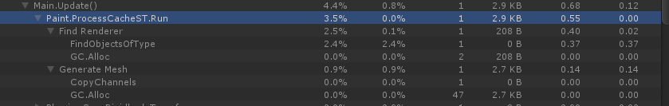

2、由于需要遍历mesh所有的三角形，因此mesh需要设置“Read Write Enableed”，GameObject也不能是静态（静态对象会合并成一个mesh，mesh是不支持读写操作）。

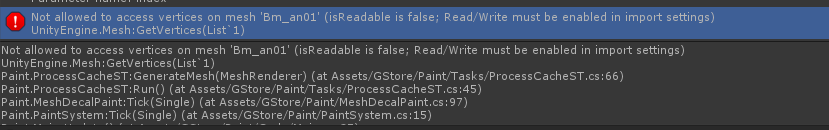

3.当投影物体改变位置会残留mesh（见下图）。

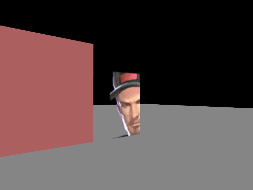

### 使用离线数据 ###
为了解决存在的问题1和2，预先将投影对象的mesh保存到一个文件中，通过多线程去裁剪和生成网格数据。

**步骤**
1.离线生成投影数据（SceneMeshTree_Export.cs）。

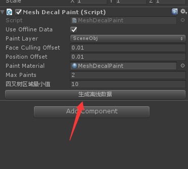
2.使用离线数据。

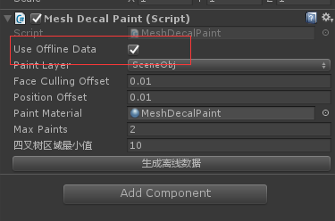
3.运行时加载投影数据（SceneMeshTree.cs）。

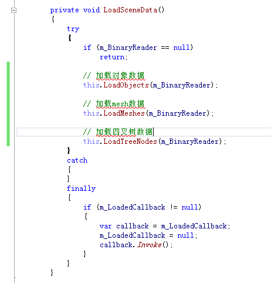

4.启动线程遍历投影对象并裁剪三角形（ProcessCacheMT.cs）。

**缺点**
1、每次改变场景都需要重新导出数据。
2、增加mono内存

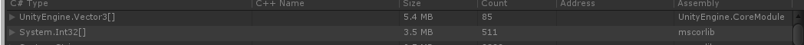

## 贴花 ##
